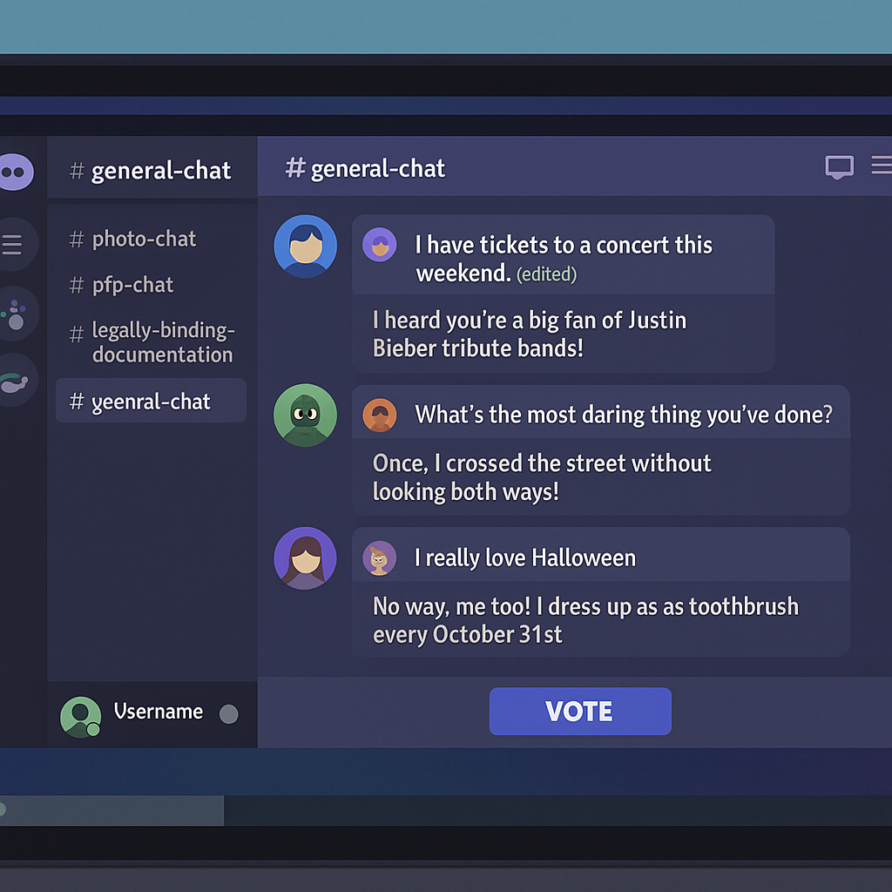
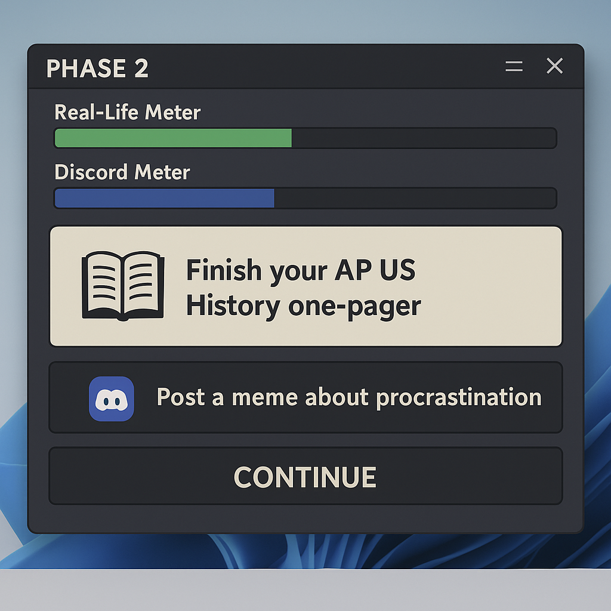

# Panic! at the Discord[^1]

## Game Overview

### Concept & Personal Connection 
*Panic! at the Discord* is a multiplayer party game that draws directly from my personal experience of participating in a high school Discord server with close friends: a space that was initially created for gaming but evolved into something far more meaningful. What started as a hub for playing games like *Among Us* together quickly became a vibrant community where we shared memes, debated silly topics, posted embarrassing photos, and supported each other through life’s ups and downs. It wasn’t just about gaming anymore; it was a place where humor reigned supreme, inside jokes flourished, and meaningful connections were forged.

However, as college approached, priorities shifted. Homework piles grew taller, deadlines loomed larger, and real-life responsibilities began to overshadow our online antics. Messages became fewer and farther between, until one day, the server went silent. Looking back, I feel a mix of nostalgia and sadness about how something so integral to our teenage years could fade away without us even realizing it. This bittersweet memory forms the emotional core of the game: the tension between staying connected online and navigating the demands of adulthood.

The game reflects this journey by alternating between two phases: one focused on the playful chaos of Discord interactions and another centered on balancing real-life obligations with maintaining those digital friendships. Through its mechanics, *Panic! at the Discord* captures the joy of sharing laughter in a group chat, the frustration of feeling overwhelmed by external pressures, and the regretful realization that sometimes, no matter how hard you try, people grow apart. By simulating these dynamics, the game invites players to reflect on their own experiences with online communities and the inevitable changes that come with growing up.

### Reflecting Emerging Trends

#### Social Media Dynamics

At its essence, *Panic! at the Discord* is a coming-of-age game that explores how friendships evolve in the digital age. Platforms like Discord have transformed how we connect, offering spaces where relationships are forged, tested, and sometimes fade over time. Originally designed for gaming, Discord has become a hub for shared experiences, from memes to heartfelt conversations. The game mirrors this dynamic through chaotic group chat interactions: posting memes, crafting witty captions, and reacting to messages. These mechanics highlight both the humor and challenges of maintaining connections online.

The game also delves into parasocial relationships, where players form bonds despite competing against each other, reflecting how online communities blend rivalry and camaraderie. In the cooperative phase, players must balance real-life responsibilities with staying active in the server, emphasizing the effort required to sustain friendships. This tension reflects the curated nature of social media personas and the bittersweet reality of growing up digitally.

#### Emerging Gaming Trends

*Panic! at the Discord* incorporates procedural storytelling, with prompts and events adapting to player progress. Early rounds focus on lighthearted high school scenarios, while later rounds tackle more stressfull college pressures. This creates an organic narrative arc that reflects real-life transitions.

The game combines competitive and cooperative mechanics, a trend seen in games like *Among Us*. Players compete for votes in the Discord antics phase but must collaborate to maintain balance in the real-life phase. Thus, this approach requires the pursuit of teamwork and shared goals, similar to how gaming brings people together: a core idea behind the original Discord server.

## Mechanics & Gameplay Breakdown

### Genre and Gameplay Mechanics

A multiplayer party game, *Panic! at the Discord* alternates between two distinct phases, each designed to reflect different aspects of online interaction and personal growth. These phases are structured around recreating the chaotic yet meaningful experience of managing a high school Discord server while growing apart over time.

#### Phase 1: Competitive Discord Antics
In this phase, players engage in humorous, chaotic interactions across four unique channels, each with its own twist on communication and creativity: #general-chat, #photo-chat, #pfp-chat, and #legally-binding-documentation. This phase draws heavily from games like *Survive the Internet* and *Cards Against Humanity*, blending competitive humor with collaborative storytelling.

1. #general-chat
   - Players receive prompts inspired by typical Discord conversations. After submitting their response, another player responds to it as if they’re part of the chat. Then, the original poster edits their message to make the responder look foolish or absurd.
   - Votes determine which edited post is funniest or most clever.
2. #photo-chat
   - Players are shown an image and tasked with writing a caption under another player’s name. The goal is to create a caption that makes the named player seem ridiculous or outlandish. Players can use pre-provided images or upload their own for added personalization.
3. #pfp-chat
   - Each player receives another player’s profile picture (or uploads one) and must draw on it based on a prompt. While the game provides suggestions, players are encouraged to interpret the prompt creatively, adding hilarious twists.
4. #legally-binding-documentation
   - Inspired by *Cards Against Humanity*, players choose from three joke legal documents with blank sections (e.g., “Agreement to Never Speak About ___ Again”). Another player fills in the blank using either provided options or their own input. The results can range from absurdly funny to hilariously specific inside jokes.
  
At the end of Phase 1, all responses are displayed anonymously, and players vote on their favorites. Points are awarded based on votes, with bonuses for successfully trolling others or creating standout content.

#### Phase 2: Balancing Real Life vs. Discord Life

After the chaos of Phase 1, players shift to a cooperative challenge where they must balance real-life responsibilities with staying active in the Discord server. Each player manages two meters:

- Real-Life Meter: Tracks academic/work obligations.
- Discord Meter: Tracks engagement in the server.

Players complete randomized task cards representing activities like “Finish your AP US History one-pager” (+Real-Life Meter) or “Post a meme about procrastination” (+Discord Meter). Success depends on teamwork. At the end of the phase, individual meters combine to determine whether the group maintains equilibrium (symbolizing that they remained close despite life’s challenges), or becomes too focused on either real life or the Discord server (causing the friendship to fade over time). Each round will introduce a variant of Phase 2 more difficult to balance than the last; for example, there will be an myriad of more responsibilities to complete while having to prepare for AP exams than during earlier in the high school year.

### How Interaction Works
Interaction in “Panic! at the Discord” is overall divided between competitive creativity and cooperative strategy. 

In Phase 1, players compete by crafting humorous responses to prompts, editing messages, or captioning images to make others look foolish; a mechanic inspired by games like *Survive the Internet*. Voting determines winners, emphasizing audience engagement and rewarding wit.

In Phase 2, players collaborate to balance real-life responsibilities with Discord activity using randomized task cards. Communication and teamwork are essential as players strategize to maintain the balance, reflecting the effort required to sustain contact in the face of external pressures. This mix of competition and cooperation reflects the way online and offline life interact with each other.

### Reflecting Player Engagement Trends of the 2010s/2020s
*Panic! at the Discord* reflects the following player engagement trends of the 2010s and 2020s:
1. User-Generated Content
   - By allowing players to upload their own images and personalize prompts, the game embraces the trend of user-generated content popularized by platforms like TikTok and Instagram. This customization not only enhances replayability but also promotes deeper connections among friends by allowing the players to navigate the game with content unique to the group.
2. Procedural Storytelling
   - Randomized prompts and events ensure no two playthroughs are identical. This procedural storytelling approach keeps gameplay fresh and unpredictable, reflecting the influence of games like *The Jackbox Party Pack* series, which thrive on improvisation and adaptability. The uniqueness in each playthrough may even increase player engagement in streaming platforms such as Twitch.
3. Community-Focused Gaming
   - Inspired by Discord itself, the game celebrates the role of online communities in fostering friendships and shared experiences. With its collaborative challenges and competitive antics, *Panic! at the Discord* emphasizes the importance of human connection in an increasingly digital world.
  

[^1]: Working title; will likely need to be changed due to copyright
